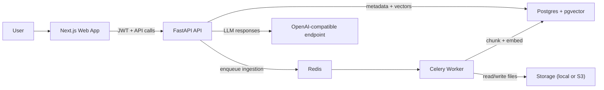

# Multi-tenant RAG Platform

Production-grade Retrieval-Augmented Generation platform for chatting with uploaded PDFs.

This project is a full-stack AI system, not a single-model demo. It combines tenant-aware authentication, asynchronous ingestion, hybrid retrieval, grounding safeguards, citation-first answers, and deployable local infrastructure.

## Key Features

- Multi-tenant workspace isolation with strict `workspace_id` scoping
- JWT authentication with access and refresh tokens
- Async PDF ingestion via Celery + Redis
- Token-aware chunking with overlap
- Embeddings stored in Postgres with `pgvector`
- Hybrid retrieval:
  - vector similarity
  - keyword relevance
  - weighted score fusion
  - MMR reranking
- Prompt-injection filtering on retrieved text
- Streaming answers via Server-Sent Events
- Citation-first responses with snippet expansion in the UI
- Evaluation harness for retrieval and grounding quality

## Tech Stack

### Frontend

- Next.js 14
- React 18
- TypeScript
- Tailwind CSS
- SSE-based chat streaming

### Backend

- FastAPI
- SQLAlchemy + Alembic
- Postgres + `pgvector`
- Redis + Celery
- PyPDF + `tiktoken`
- OpenAI-compatible responses endpoint
- Hugging Face embeddings (`BAAI/bge-large-en-v1.5`)

## Repository Structure

```text
backend/
  app/
    api/routes/         # auth, documents, chat, workspaces, health
    core/               # config, auth, logging, rate limiting
    db/                 # models and sessions
    services/           # retrieval, chunking, storage, answer generation
    tasks/              # Celery app and ingestion tasks
    eval/               # retrieval and grounding evaluation logic
  alembic/
  tests/
  scripts/
web/
  app/
  components/
  lib/
data/
  storage/
docker-compose.yml
```

## Architecture



## Prerequisites

- Docker + Docker Compose
- A valid API key for the configured model provider
- A strong `JWT_SECRET_KEY`

Optional for local non-Docker workflows:

- Python 3.11+
- Node.js 18+

## Getting Started (Docker)

### 1. Clone the repository

```bash
git clone https://github.com/kenshiro-17/Multi-tenant-RAG-Platform.git
cd 'RAG App'
```

### 2. Configure environment variables

```bash
cp .env.example .env
```

Minimum values to set:

| Variable | Purpose |
| --- | --- |
| `OPENAI_API_KEY` | Model or router API key |
| `OPENAI_BASE_URL` | OpenAI-compatible endpoint |
| `JWT_SECRET_KEY` | Auth signing secret |
| `DATABASE_URL` | Postgres connection string |
| `REDIS_URL` | Redis URL |
| `NEXT_PUBLIC_API_URL` | Frontend API base URL |

Important toggles:

- `AUTH_DISABLED=true` allows easier local demo mode
- `EMBEDDING_PROVIDER`, `EMBEDDING_MODEL`, and retrieval weights control retrieval behavior
- `LOCAL_STORAGE_PATH` configures file storage when using local storage mode

### 3. Start the stack

```bash
docker compose up --build -d
docker compose exec api alembic upgrade head
```

Endpoints:

- Web: `http://localhost:3000`
- API docs: `http://localhost:8000/docs`
- Health: `http://localhost:8000/health`

## API Surface

- `POST /auth/register`
- `POST /auth/login`
- `POST /auth/refresh`
- `GET /me`
- `GET /workspaces`
- `POST /workspaces`
- `GET /documents`
- `POST /documents/upload`
- `DELETE /documents/{id}`
- `POST /documents/{id}/reindex`
- `POST /chat` (SSE)
- `GET /health`

## Retrieval Pipeline

1. Store the uploaded PDF in configured storage
2. Parse and chunk the document asynchronously
3. Generate embeddings for chunks
4. Store vectors and metadata in Postgres with `pgvector`
5. Embed incoming query
6. Retrieve vector candidates
7. Retrieve keyword candidates via Postgres text search
8. Fuse scores and rerank with MMR
9. Sanitize retrieved text for prompt-injection patterns
10. Generate a citation-first answer and stream it to the client

## Evaluation and Safety

The repo includes a real evaluation layer, not just application code.

Covered concerns include:

- retrieval quality
- grounding quality
- prompt-injection filtering
- citation enforcement
- tenant isolation

Run tests:

```bash
pytest backend/tests -q
```

If you have evaluation scripts configured in `backend/eval/` and `backend/scripts/`, run them after migrations and data setup to validate retrieval behavior under your target model/provider settings.

## Local Development Without Docker

If you need to run services manually:

### Backend

```bash
cd backend
pip install -r requirements.txt
uvicorn app.main:app --reload
```

### Worker

```bash
cd backend
celery -A app.tasks.celery_app.celery worker -l info
```

### Frontend

```bash
cd web
npm install
npm run dev
```

## Deployment Notes

This project is structured to be deployable, not just runnable.

Production concerns already reflected in the codebase include:

- background ingestion jobs
- durable vector storage
- auth tokens
- prompt-injection filtering
- SSE streaming
- observability hook points
- local or S3-compatible file storage options

Before production deployment:

- disable `AUTH_DISABLED`
- set a strong `JWT_SECRET_KEY`
- use managed Postgres and Redis
- configure monitoring and Sentry if needed
- validate model/provider latency and cost at expected document volume

## Troubleshooting

### Frontend cannot reach backend

Check `NEXT_PUBLIC_API_URL` and CORS configuration.

### Ingestion jobs do not process

Check that Redis is reachable and the Celery worker is running.

### Vectors are not created

Verify embedding credentials and provider/model settings in `.env`.

### Auth issues in local demo mode

Confirm whether `AUTH_DISABLED` is intentionally enabled.

## License

Add a project license if you plan to distribute or collaborate publicly.
